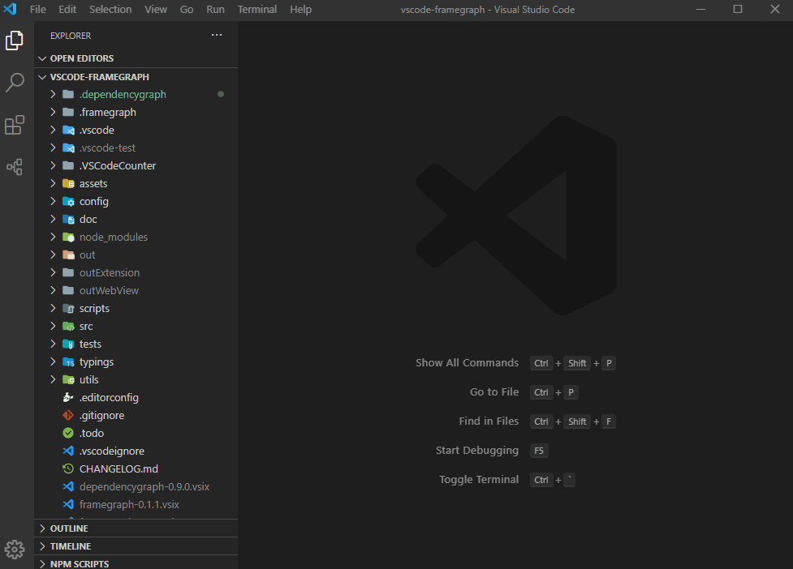
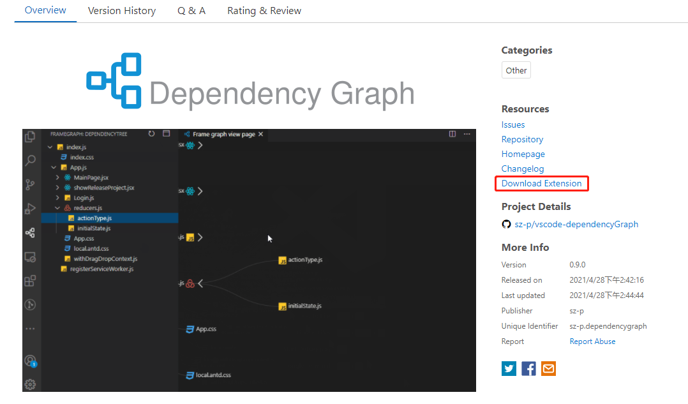
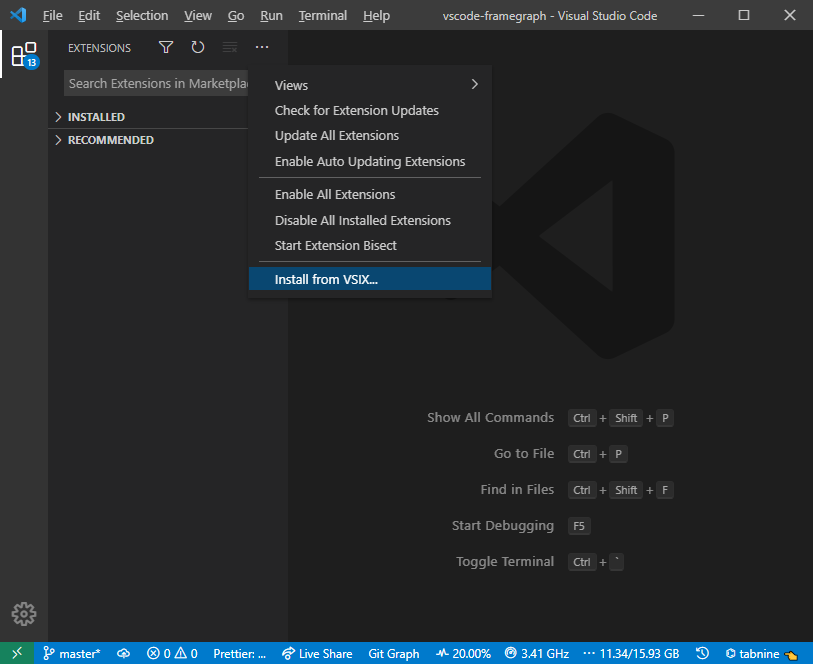
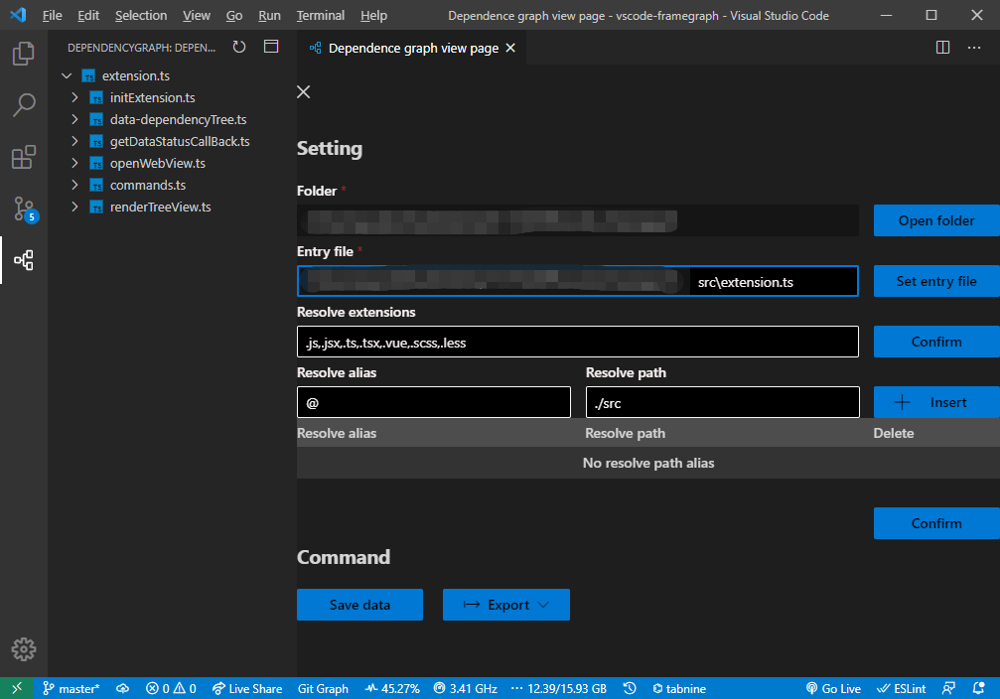
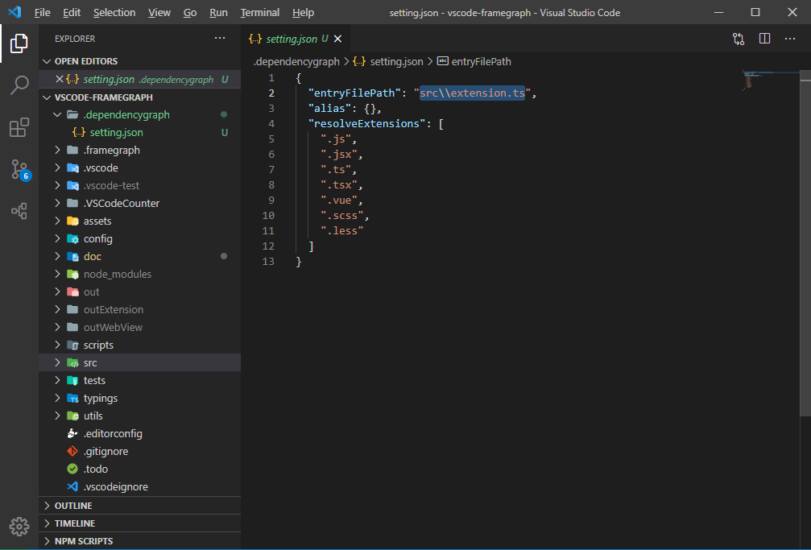
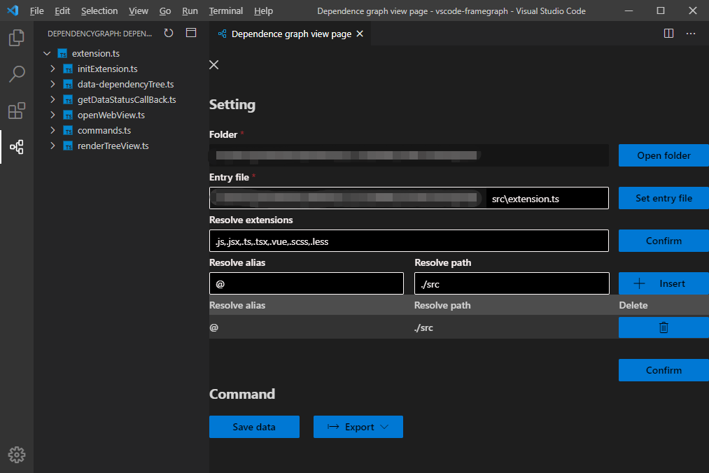
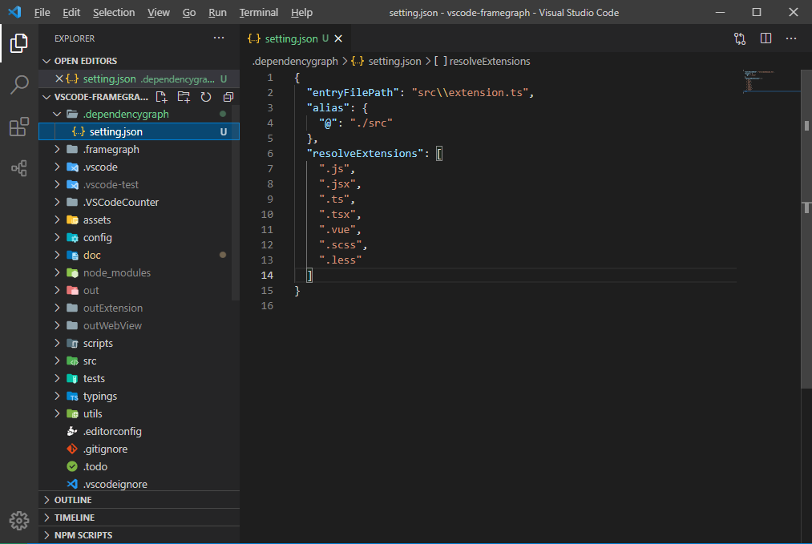
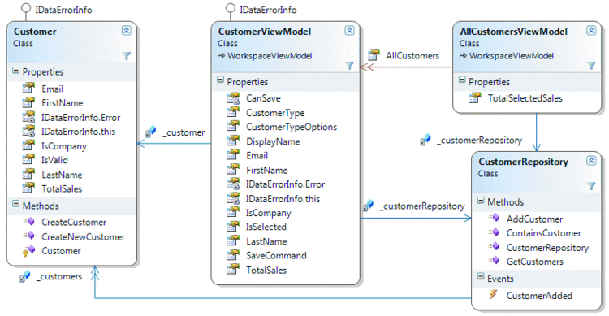

<p align="middle" ></p>

<p align='center'>
<a href="./README.md">English</a> | 简体中文
</p>

## 📝简介

一个用来查看项目文件依赖的VsCode插件。



## 🔥 功能

* **查看文件依赖** 根据入口文件分析项目文件依赖关系，生成文件依赖树。
* **保存依赖关系** 将项目文件的依赖关系以文件的方式保存在项目本地。
* **导出依赖关系** 可将页面中的依赖关系图以`png`或`svg`格式导出至本地。
* **提取文件基本信息** 提取文件`类型、行数、简介、详情`等基本信息给予展示。
* **提取核心方法** 提取代码文件中的`方法`及`注释`并在详情中给予展示。
## ⚙️ 安装
### 扩展市场

在扩展市场搜索`dependencygraph`，下载如图所示的插件即可。


### 离线安装

[下载.vsix文件](https://marketplace.visualstudio.com/items?itemName=sz-p.dependencygraph)



使用`.vsix`文件离线安装插件




## 🚀 使用

### 设置入口文件

可在`画板`中通过`GUI`的方式设置。



可在`设置文件`中通过`配置属性`的方式设置(设置文件路径为`.dependencygraph/setting.json`)。



### 设置路径别名及被解析文件

可在`画板`中通过`GUI`的方式设置。

解析文件类型以`,`分割直接往后累加即可。路径别名手动添加后注意要确认。



可在`设置文件`中通过`配置属性`的方式设置(设置文件路径为`.dependencygraph/setting.json`)。

解析文件类型为一个数组，可直接添加，路径别名为一个对象以`key` `value`的形式做映射。



### 设置文件简介及描述

文件`简介`及`注释`以一下方式在文件中书写，即可被插件识别。

```js
/**
 * @introduction 这里是文件简介
 *
 * @description 这里是文件描述\n 之后的字符会在下一行展示
 */
```

## 📝 已支持的文件

| 文件类型 | .js  | .ts  | .jsx | .tsx | .vue | .scss | .less | .sass | .py  | .php | .go  |
| -------- | ---- | ---- | ---- | ---- | ---- | ----- | ----- | ----- | ---- | ---- | ---- |
| 支持状态 | ✅    | ✅    | ✅    | ✅    | ✅    | ✅     | ✅     | ✅     |      |      |      |

## 📡 工作原理

1. 将入口文件以文本方式读取，以`正则表达式`的方式获取其`简介`和`描述`.。
2. 将代码文件基于[babel parser](https://github.com/babel/babel/tree/main/packages/babel-parser)解析为`AST`,分析`AST`获取`import`和`require`的参数，将其值作为该文件的依赖项。
3. 根据`import`和`require`的参数和当前文件的绝对路径基于[enhanced-resolve](https://github.com/webpack/enhanced-resolve)获取依赖文件的绝对路径。将被依赖文件压入待分析队列。
4. 分析整个队列获取完整依赖树。

## 🌌 目标

最终视图形成类似于`visual studio class view`的分析页面,帮助开发者查看和分析`文件依赖`和`模块关系`。



## 🔧 开发

### `yarn install`

安装必要的依赖。

### `yarn watch`

监听文件变化，并编译文件。

### `F5`

以`vscode`打开该项目按下`F5`来启动调试程序。test


## 🚦 测试

### `yarn test`

可以在[tests](https://github.com/sz-p/vscode-dependencyGraph/tree/master/tests)下来找到测试用例，以`yarn test`指令来执行。

## ⭐️ 支持

如果该项目有帮到你请点击右上角的`start`来支持开发者。

## 👏 贡献

如果有任何问题或者功能请求, 请在此[issue](https://github.com/sz-p/vscode-dependencyGraph/issues)填写，或直接对该项目提交`Pull Request`。

## 🐞 问题反馈

如果发现BUG或其他任何问题，可直接在`Github`上提交[Issue](https://github.com/sz-p/vscode-dependencyGraph/issues)。
