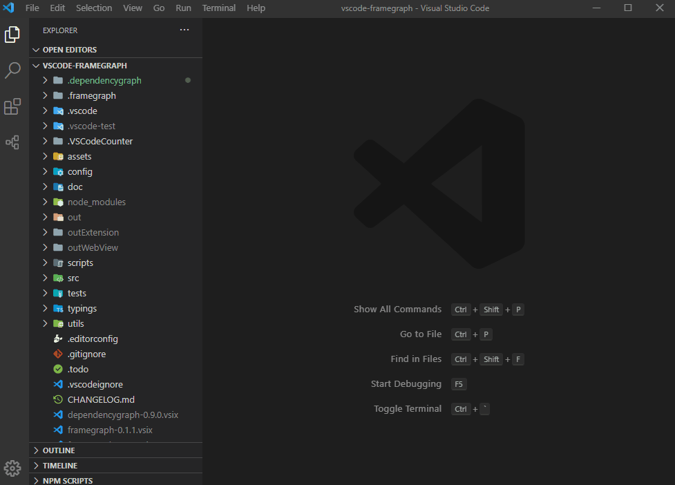
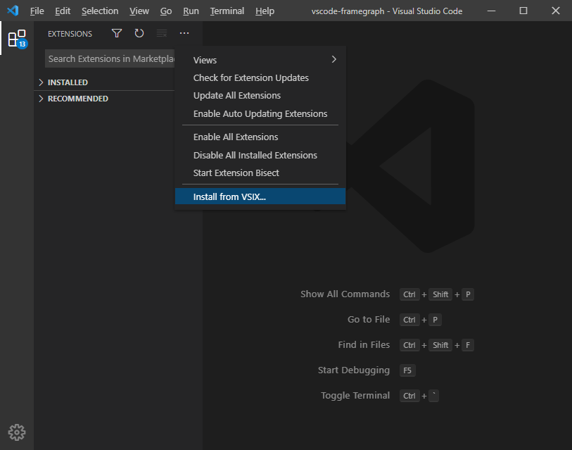

<p align="middle" ></p>

<p align='center'>
English | <a href="./README-zh-CN.md">简体中文</a>
</p>

## 📝 Introduction

A plugin for vscode to view your project's dependency graph



## 🔥 Features

* **Show dependency graph** show dependency graph by analyze the entry file.
* **Save dependency tree data** save dependency tree data to local json file.
* **Export dependency graph img** export dependency graph's `svg` or `png`.
* **Extract basic information from file** extract file's`type,line count,introduction,description` for display.
* **Extract function and comment from code file** extract code file's`function` and `comment` for display.

## ⚙️ Installation

### From marketplace

Search `dependencygraph` in extensions marketplace, download the extension in the following figure.


### From .vsix file

[download .vsix file](https://marketplace.visualstudio.com/items?itemName=sz-p.dependencygraph)


Use `.vsix` file install extension offline



## 🚀 How to use

### Set entry file path

### Set resolve or alias

### Set file information and description

文件`简介`及`注释`以一下方式在文件中书写，即可被插件识别。

```js
/**
 * @introduction This is introduction
 *
 * @description This is description\n this sentences will show 
 */
```
## 📝 Supported file

| File type | .js  | .ts  | .jsx | .tsx | .vue | .scss | .less | .sass | .py  | .php | .go  |
| -------- | ---- | ---- | ---- | ---- | ---- | ----- | ----- | ----- | ---- | ---- | ---- |
| Support status | ✅    | ✅    | ✅    | ✅    | ✅    | ✅     | ✅     | ✅     |      |      |      |

## 📝 How it work

1. Read entry file as string, get `introduction` and `description` by `regular expression`.
2. Use [babel parser](https://github.com/babel/babel/tree/main/packages/babel-parser) to get code file's `AST`. get file dependencies by `import` and `require` value from analyze `AST`.
3. Use [enhanced-resolve](https://github.com/webpack/enhanced-resolve) to get dependencies absolute path by values of `import` and `require` and file's absolute path. set dependencies absolute path to file queue
4. Analyze file queue to get whole dependency tree

##  🌌 Target 

To build a graph like `visual studio class view` for developer to view and analyze `dependency tree` or `module relationship`


## 🔧  Develop

### `yarn install`

install necessary dependency packages.

### `yarn watch`

watch file change and build file.

### `F5`

press `F5` in vscode to start dev process.

## 🚦 Testing

### `yarn test`

You can find test case in [tests](https://github.com/sz-p/vscode-dependencyGraph/tree/master/tests). use `yarn test` to start testing

## ⭐️ Show Your Support
Please give a ⭐️ if this project helped you!

## 👏 Contributing

If you have any questions or requests or want to contribute to `DependencyGraph`, please write the [issue](https://github.com/sz-p/vscode-dependencyGraph/issues) or give me a Pull Request freely.

## 🐞 Bug Report

If you find a bug, please report to us opening a new [Issue](https://github.com/sz-p/vscode-dependencyGraph/issues) on GitHub.
